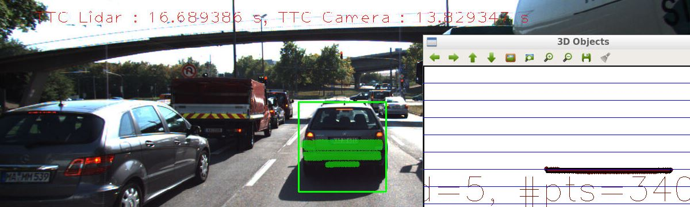
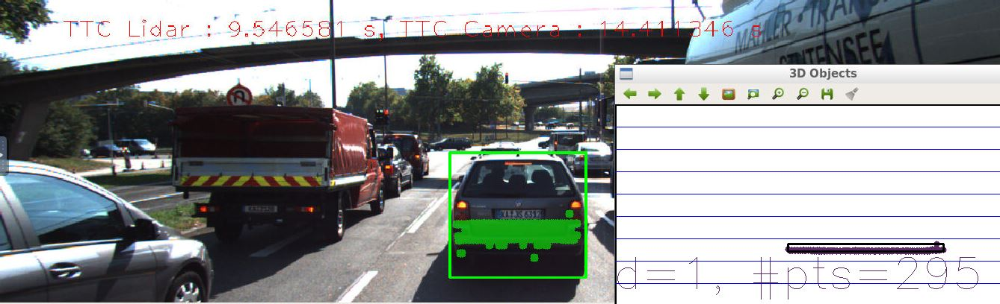

#3D Object Tracking project
##  Work done during the project

1. FP.1 : Match 3D Objects : to match the bounding boxes, I looped over bounding boxes in previuos frame then make sure that each of "matches" keypoints is existed in the box in both previous and current frame and based on that I would increase the number within "count" by one then after looping finish, I would choose the best math based on "count" value.
2. FP.2 : Compute Lidar-based TTC: I make a help function called "sortLidarX" to first sort the values of points so that I could use the median to calculate the TTC as It is more robust than the mean when it comes to outliers.
3. FP.3 : Associate Keypoint Correspondences with Bounding Boxes: I first checked if the matches keypoints is contained into the box, then I took into consideration all keypoints inside the bounding boxes and store them in "matchings" and calculate dist to filter out those points by the mean distance then finally stored the filtered points into the kptMatches.
4. FP.4 : Compute Camera-based TTC: firstly I looped over all matches and collect  current keypoints, then I looped again to get the next keypoints, then I calculated the median of  distance ratios to compute the TTC.
5. FP.5 : Performance Evaluation 1: in general the lidar TTC values have ranged from nearly 8.3 to 14 but as can be seen in the two images, some outliers rarely appeared causing some errors in the estimation and they need a more detailed filteration process : 

6. FP.6 : Performance Evaluation 2: all possible detector / descriptor combinations were implemented to test how would be the TTC values and I found that TTC lidar values were in most cases better and reliable that the camera ones. Also I found that shitomasi, harris, and ORB detectors had the worst performance with camera TTC estimation, whereas, In the other side, the FAST, BRISK and SIFT detectors performed very well with both camera and lidar TTCs. the file "results.txt" contain all the tests values and by comparing all results, the best three combinations in terms of reliability, accuracy, and limited difference between TTC values from different sensors are:
	1. SIFT,FREAK
    2. FAST,FREAK
    3. SIFT,BRIEF

## Overview of SFND 3D Object Tracking project

Welcome to the final project of the camera course. By completing all the lessons, you now have a solid understanding of keypoint detectors, descriptors, and methods to match them between successive images. Also, you know how to detect objects in an image using the YOLO deep-learning framework. And finally, you know how to associate regions in a camera image with Lidar points in 3D space. Let's take a look at our program schematic to see what we already have accomplished and what's still missing.

In this final project, you will implement the missing parts in the schematic. To do this, you will complete four major tasks: 
1. First, you will develop a way to match 3D objects over time by using keypoint correspondences. 
2. Second, you will compute the TTC based on Lidar measurements. 
3. You will then proceed to do the same using the camera, which requires to first associate keypoint matches to regions of interest and then to compute the TTC based on those matches. 
4. And lastly, you will conduct various tests with the framework. Your goal is to identify the most suitable detector/descriptor combination for TTC estimation and also to search for problems that can lead to faulty measurements by the camera or Lidar sensor. In the last course of this Nanodegree, you will learn about the Kalman filter, which is a great way to combine the two independent TTC measurements into an improved version which is much more reliable than a single sensor alone can be. But before we think about such things, let us focus on your final project in the camera course. 

## Dependencies for Running Locally
* cmake >= 2.8
  * All OSes: [click here for installation instructions](https://cmake.org/install/)
* make >= 4.1 (Linux, Mac), 3.81 (Windows)
  * Linux: make is installed by default on most Linux distros
  * Mac: [install Xcode command line tools to get make](https://developer.apple.com/xcode/features/)
  * Windows: [Click here for installation instructions](http://gnuwin32.sourceforge.net/packages/make.htm)
* OpenCV >= 4.1
  * This must be compiled from source using the `-D OPENCV_ENABLE_NONFREE=ON` cmake flag for testing the SIFT and SURF detectors.
  * The OpenCV 4.1.0 source code can be found [here](https://github.com/opencv/opencv/tree/4.1.0)
* gcc/g++ >= 5.4
  * Linux: gcc / g++ is installed by default on most Linux distros
  * Mac: same deal as make - [install Xcode command line tools](https://developer.apple.com/xcode/features/)
  * Windows: recommend using [MinGW](http://www.mingw.org/)

## Basic Build Instructions

1. Clone this repo.
2. Make a build directory in the top level project directory: `mkdir build && cd build`
3. Compile: `cmake .. && make`
4. Run it: `./3D_object_tracking`.
